<div align="center">



<a href="https://git.io/typing-svg">
  
</a>

<br/><br/>


</div>

---

## 👻 What is GhostCheck?

**GhostCheck** is a complete web intelligence and security analysis platform. Drop any URL, domain or IP — it runs 30+ checks covering SSL, DNS, open ports, HTTP headers, WAF detection, threat intelligence, cookies, TLS config, WHOIS, social tags and more, all in one clean terminal-dark interface.

Forked from the original `web-check`, fully redesigned and security-audited by **[krypthane](https://github.com/wavegxz-design)** — Red Team Operator · Mexico 🇲🇽.

---

## 🎨 Interface Redesign

Complete visual overhaul from the original — every component rebuilt:

| Component | Change |
|-----------|--------|
| **Palette** | Void black `#07060f` + Ghost red `#ff2d2d` + Intel cyan `#00cfff` |
| **Home** | Terminal-style hero with macOS-dot title bar, prompt line, glitch title animation |
| **Background** | Red + cyan particle field (ghost traces) replacing green-only |
| **Nav** | Sticky dark bar with ghost icon, krypthane branding, pulse status dot |
| **Footer** | Dual MIT copyright + krypthane links |
| **Cards** | Left red accent border + glow on hover |
| **Buttons** | Ghost style — transparent + red border + glow on hover |
| **Inputs** | Void dark + red focus ring glow |
| **Scrollbar** | Thin 5px red custom scrollbar |
| **Scan beam** | Animated diagonal line sweeping across hero |

---

## 🛠 Supported Checks

```
┌─────────────────────────┬──────────────────────────┬────────────────────────┐
│  SECURITY               │  INFRASTRUCTURE           │  INTELLIGENCE          │
├─────────────────────────┼──────────────────────────┼────────────────────────┤
│  SSL Certificate        │  DNS Records              │  WHOIS / RDAP          │
│  TLS Config & Ciphers   │  DNSSEC                   │  Domain Rank           │
│  HTTP Security Headers  │  Open Port Scan           │  Wayback Machine       │
│  HSTS                   │  Traceroute               │  Social Tags / OG      │
│  Firewall / WAF Detect  │  Server Location          │  Linked Pages          │
│  Threat Intel           │  Server Info & Banner     │  Sitemap               │
│  Block List Check       │  Mail Config (SPF/DKIM)   │  Robots.txt            │
│  Content Security       │  DNS Server Detection     │  Tech Stack            │
│  Cookies                │  Carbon Footprint         │  Security.txt          │
│  Redirects              │  Screenshots              │  Quality (Lighthouse)  │
└─────────────────────────┴──────────────────────────┴────────────────────────┘
```

---

## 🐛 Security Audit & Bug Fixes — v2.0

> Full audit + patches by **krypthane**

| ID | File | Issue | Severity | Fix |
|----|------|-------|----------|-----|
| BUG-MW-01 | `middleware.js` | Dual `module.exports` + `export default` — CJS/ESM conflict | HIGH | ESM only |
| BUG-MW-02 | `middleware.js` | All errors returned 500, including timeouts | MED | 408 for timeouts, 400 for missing URL |
| BUG-MW-03 | `middleware.js` | Typos in user-facing error ("temporatily", "instand") | LOW | Fixed |
| BUG-TLS-01 | `tls.js` | Mozilla TLS Observatory **dead since 2019** | CRITICAL | `tls.connect()` + SSLLabs fallback |
| BUG-TLS-02 | `tls.js` | No timeout | MED | `timeout: 10000` |
| BUG-WHOIS-01 | `whois.js` | Hardcoded personal endpoint — SSRF risk | HIGH | IANA RDAP API |
| BUG-WHOIS-02/03 | `whois.js` | No timeout on axios or TCP socket | MED | 8–10s timeouts |
| BUG-SS-01 | `screenshot.js` | 17× `console.log` leaked URLs + paths to prod logs | MED | Leveled logger (`DEBUG=true`) |
| BUG-SS-02 | `screenshot.js` | `--no-sandbox` hardcoded — disables Chromium security | HIGH | `ALLOW_NO_SANDBOX=true` env var |
| BUG-SS-03 | `screenshot.js` | Temp files not cleaned up on early failure | LOW | `try/finally` |
| BUG-BL-01 | `block-lists.js` | `dns.resolve4({ server })` silently ignored by Node.js | CRITICAL | `dns.Resolver` + `setServers()` |
| BUG-PORT-INT | `ports.js` | Env ports used as strings in `socket.connect()` | MED | `parseInt()` + range validation |
| BUG-LP-01 | `linked-pages.js` | No `try/catch` on `axios.get` — crash on any error | MED | Wrapped with try/catch |
| BUG-DNS-01 | `dns-server.js` | Domain extracted without URL validation | MED | `new URL()` constructor |
| NO-TIMEOUT | 11 files | All axios calls missing timeout | MED | `timeout: 8000–20000` per handler |
| ERR-EXPOSE | 2 files | Raw `error.message` sent to clients | MED | Generic messages returned |

---

## 🚀 Installation

```bash
git clone https://github.com/wavegxz-design/web-check
cd web-check
cp .env .env.local    # edit with your API keys
yarn install
yarn dev              # starts API + frontend
```

### Docker

```bash
docker-compose up -d
```

---

## ⚙️ Environment Variables

```bash
# Optional — tool works without them, but enables more checks
GOOGLE_CLOUD_API_KEY=''       # Lighthouse + Google Safe Browsing
SECURITY_TRAILS_API_KEY=''    # DNS history
BUILT_WITH_API_KEY=''         # Tech stack detection
URL_SCAN_API_KEY=''           # URL scanning
CLOUDMERSIVE_API_KEY=''       # Virus scan

# Config
API_TIMEOUT_LIMIT='10000'     # Request timeout ms (default 60000)
API_CORS_ORIGIN='*'           # CORS allowed origins
API_ENABLE_RATE_LIMIT='true'  # Enable rate limiting
CHROME_PATH='/usr/bin/chromium'
ALLOW_NO_SANDBOX='false'      # Only true in trusted containers
DEBUG='false'                 # Verbose logging
```

---

## 📁 Structure

```
web-check/
├── api/                        ← Node.js API handlers (one per check)
│   ├── _common/middleware.js   ← Fixed: dual-export + timeouts + 408 codes
│   ├── tls.js                  ← Rebuilt: dead API → tls.connect()
│   ├── whois.js                ← Rebuilt: personal endpoint → IANA RDAP
│   ├── screenshot.js           ← Fixed: log leaks + no-sandbox + cleanup
│   ├── block-lists.js          ← Fixed: dns.Resolver with setServers()
│   └── ...28 more handlers
├── src/
│   ├── web-check-live/
│   │   ├── views/Home.tsx      ← Full redesign: ghost terminal hero
│   │   ├── components/
│   │   │   ├── Form/Nav.tsx    ← New sticky ghost nav
│   │   │   ├── Form/Button.tsx ← Ghost glow style
│   │   │   ├── Form/Card.tsx   ← Left red accent border
│   │   │   ├── Form/Input.tsx  ← Void dark + red focus glow
│   │   │   └── misc/Footer.tsx ← Dual MIT copyright
│   │   ├── styles/colors.ts    ← Ghost palette (#07060f / #ff2d2d / #00cfff)
│   │   └── styles/globals.tsx  ← Red scrollbar + font stack
│   └── styles/colors.scss      ← CSS vars for Astro pages
├── banner.svg                  ← Animated ghost SVG banner
└── LICENSE                     ← MIT · Alicia Sykes 2023 / krypthane 2026
```

---

## ⚖️ License

```
MIT License

Copyright (c) 2023 Alicia Sykes <https://github.com/lissy93>  (original)
Copyright (c) 2026 krypthane   <https://github.com/wavegxz-design>  (fork)

Permission is hereby granted, free of charge, to any person obtaining a copy
of this software and associated documentation files to deal in the Software
without restriction — see LICENSE file for full terms.
```

---

## ⚠️ Legal

```
For authorized security research, ethical analysis, and educational use ONLY.

✅  Analyzing your own domains / infrastructure
✅  Bug bounty programs (within scope)
✅  CTF competitions
✅  Security hardening and research

❌  Unauthorized scanning of third-party systems
❌  Any illegal activity under local or international law

Author assumes NO responsibility for misuse.
```

---

## 👤 Author

<div align="center">

[](https://github.com/wavegxz-design)
[](https://t.me/Skrylakk)
[](mailto:Workernova@proton.me)
[](https://krypthane.workernova.workers.dev)

**krypthane** — Red Team Operator · Security Researcher · Open Source Dev · Mexico 🇲🇽

*"Know the attack to build the defense."*

</div>
